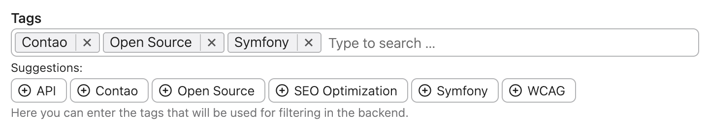

# Tags Bundle extension for Contao Open Source CMS

Tags Bundle is an extension for the [Contao Open Source CMS](https://contao.org).

The extension provides the tagging functionality in Contao. Backend widget is powered up by the excellent
UI widget [Tom Select](https://tom-select.js.org/) that allows to easily manage tags.

> **IMPORTANT NOTE:** This project is aimed at the developers and it does not provide tagging 
  to any of standard Contao features by default!

## Documentation

1. [Installation](docs/01-installation.md)
2. [Configuration](docs/02-config.md)
3. [Usage](docs/03-usage.md)
4. [Managers](docs/04-managers.md)
5. [Backend interface](docs/05-backend.md)
6. [Insert tags](docs/06-insert-tags.md)

## Copyright

This project has been created and is maintained by [Codefog](https://codefog.pl).
