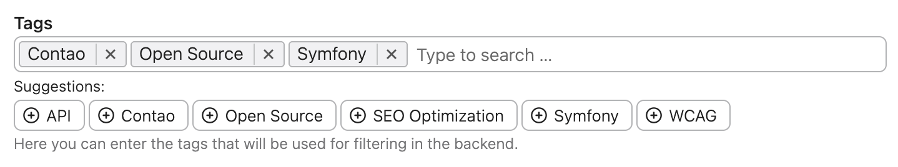
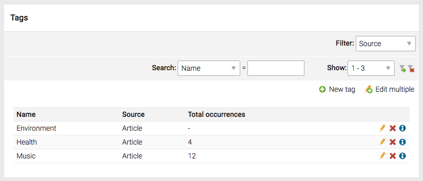

# Backend Interface – Tags Bundle

1. [Installation](01-installation.md)
2. [Configuration](02-config.md)
3. [**Backend interface**](03-backend.md)
4. [Managers](04-managers.md)
5. [Insert tags](05-insert-tags.md)

## Tags widget

The tags widget Frontend is powered up by the excellent UI widget
[selectize.js](https://github.com/selectize/selectize.js) that allows to easily manage tags. 

### Selecting the tags

The tags can be selected either by clicking them above the input field or selecting them from dropdown
that appears when you start typing in.

### Removing the tags

To remove the tags simply click on them in the input field or hit the backspace key when the input
field is focused.

### Adding new tags

You can add the new tags on the fly by typing them into the input field. If no existing tag will be found
then you will notice a new option in the dropdown field that will say "Add <your_tag>...".

## Tags module

The extension comes out of the box with the backend module to manage the tags. Here you can preview
the tags from different sources.

Beside creating the tags *on the fly* using the widget, you can also predefine them here.
 

